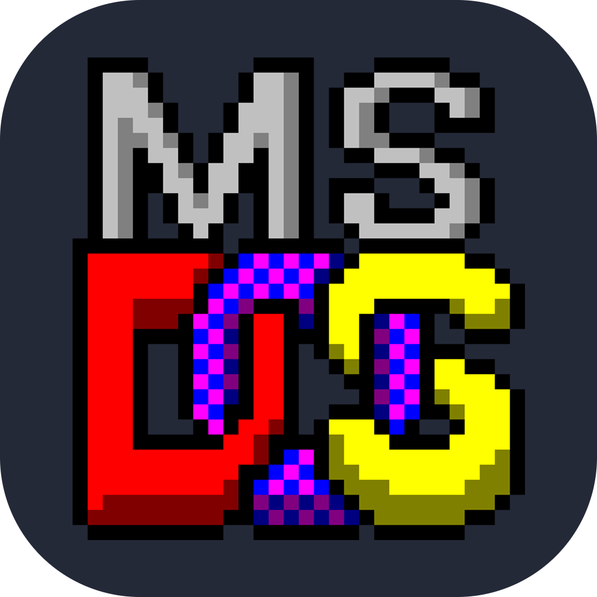
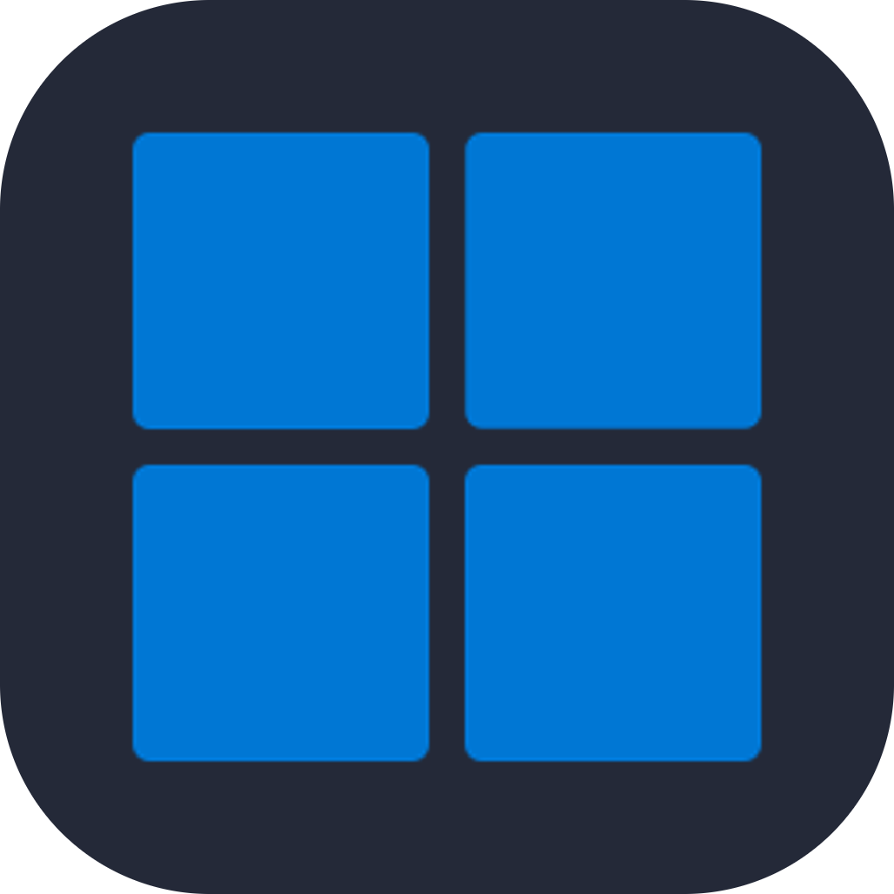
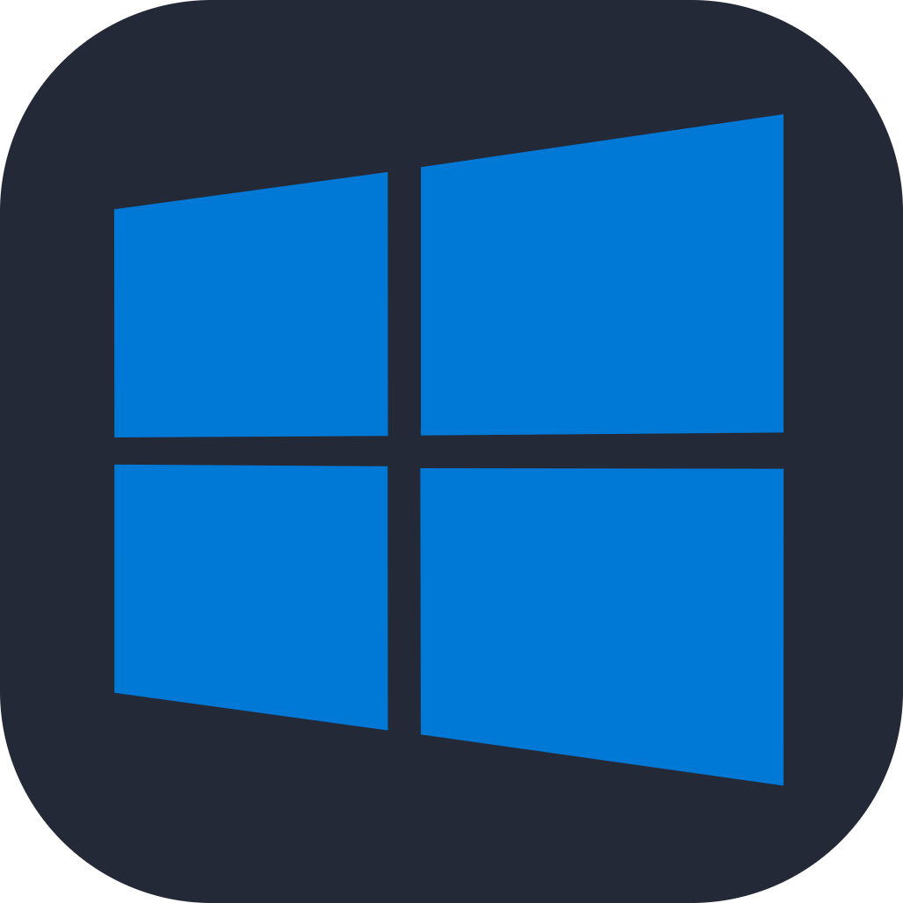
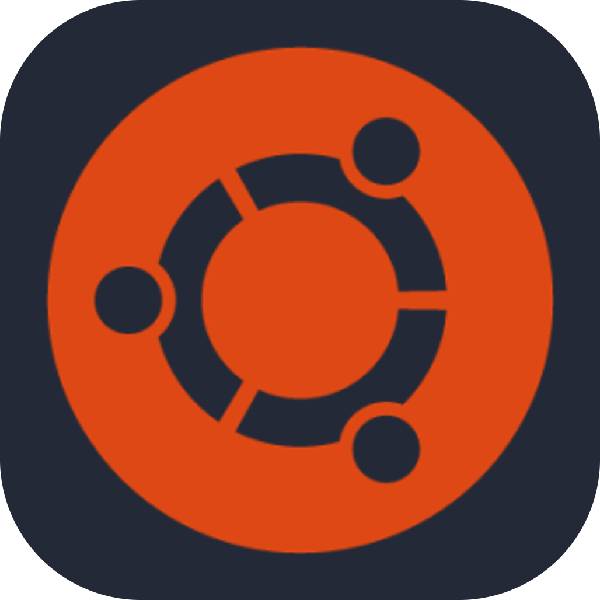
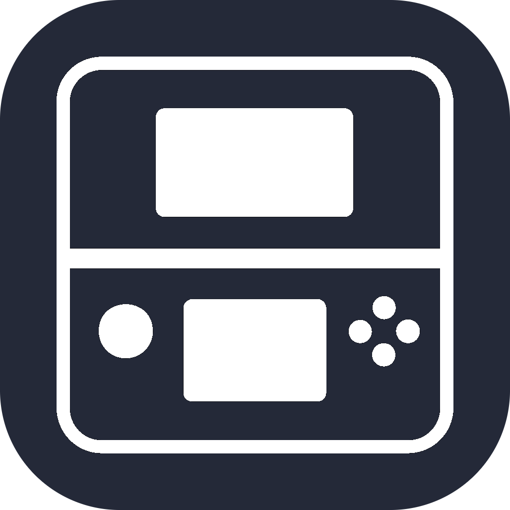
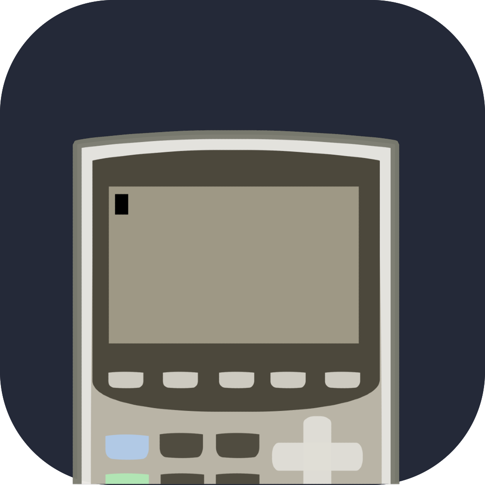

 <a href="https://git.io/typing-svg"></a>
<div align="center">

  <a href="https://git.io/typing-svg"></a>

  ---


<br>


<br>


<br>


<br>


<br><br>

[](https://discord.com/users/926788037785047050)
  
  ## ⚧️</br>Name & Pronouns

  

  **Zena "Z" Comerford**</br>
  **ZcraftElite**</br>
  **She/Her - They/Them**</br>
  [**See more at my Pronouns Page**](https://en.pronouns.page/@zcraftelite)

  ## 💡</br>Daily Tip
<!--START_SECTION:zDailyTip-->
📚 "Try to learn something new every week, even if it’s small!"
<!--END_SECTION:zDailyTip-->
  

  ## 🐕</br>About Me

  <table>
    <tr>
        <th align="left">
            <code>👧</code> Cute girl against the world </br>
            <code>🐶</code> Professional wolf-protogen hybrid </br>
            <code>❤️</code> Total sucker for any kind of attenton </br>
            <code>📺</code> Obsessed with Crime Shows & Olivia Benson is my idol </br>
            <code>🖥️</code> Loves to code random useful utilities and other random stuff </br>
            <code>🗨️</code> Talks constantly on Discord (when I'm not in a lecture) </br>
            <code>🎮</code> Loves video games, especially Minecraft, Fortnite & Rainbow 6 </br>
            <code>🖊️</code> Aspiring biochemist & quantum physics nerd </br>
            <code>💻</code> Linux fangirl, probably fixing something I broke on my system </br>
            <code>🎧</code> Vibing to music 24/7 (bonus points if it’s slutcore or game OSTs) </br>
            <code>🌙</code> Night owl who does her best thinking at 3 AM </br>
            <code>🫂</code> Super caring friend who loves everyone </br>
            <code>🖌️</code> Digital artist & tablet gremlin </br>
            <code>📝</code> Forever journaling random thoughts and lore ideas </br>
            <code>😈</code> Slightly chaotic, but in an endearing way </br>
        </th>
    </tr>
  </table>

  
  ## 🖱️</br>Stuffs I use
  
<table border="0">
    <tr>
        <th colspan="2"><code>></code> Languages I know <code><</code></th>
        <th colspan="2"><code>></code> Languages on Github <code><</code></th>
    </tr>
    <tr>
        <td align="center">
            <span>Bash</span><br><br>
            <span>Batch</span><br><br>
            <span>Python</span><br><br>
            <span>HTML 5</span><br><br>
            <span>CSS 3</span><br><br>
        </td>
        <td align="center">
            <span>VBScript</span><br><br>
            <span>JavaScript</span><br><br>
            <span>C</span><br><br>
            <span>Lua</span><br><br>
            <span>Java</span><br><br>
        </td>
        <td colspan="2">
            
        </td>
    </tr>
    <tr>
        <th><code>></code> Editors <code><</code></th>
        <th><code>></code> Socials <code><</code></th>
        <th colspan="2"><code>></code> Platforms <code><</code></th>
    </tr>
    <tr>
        <td align="center">
            <span>Visual Studio</span><br><br>
            <span>VS Code</span><br><br>
            <span>Sublime Text</span><br><br>
        </td>
        <td align="center">
            <span>Github</span><br><br>
            <span>Discord</span><br><br>
            <span>Twitter</span><br><br>
        </td>
        <td align="center">
            <span>Github Actions</span><br><br>
            <span>Github</span><br><br>
            <span>Google Cloud</span><br><br>
        </td>
        <td align="center">
            <span>Repl.it</span><br><br>
            <span>Gitlab</span><br><br>
        </td>
    </tr>
</table>

<table>
    <tr>
        <th colspan="5"><code>></code> Operating Systems <code><</code></th>
    </tr>
    <tr>
        <td align="center">
            <span>MS-DOS</span><br><br>
        </td>
        <td align="center">
            <span>Windows 11</span><br><br>
        </td>
        <td align="center">
            <span>Windows 10</span><br><br>
        </td>
        <td align="center">
            <span>Windows XP</span><br><br>
        </td>
        <td align="center">
            <span>Ubuntu</span><br><br>
        </td>
    </tr>
    <tr>
        <td align="center">
            <span>Linux Mint</span><br><br>
        </td>
        <td align="center">
            <span>Android</span><br><br>
        </td>
        <td align="center">
            <span>3DS Family</span><br><br>
        </td>
        <td align="center">
            <span>TI-83/84</span><br><br>
        </td>
        <td align="center">
            <span>Arch Linux</span><br><br>
        </td>
    </tr>
</table>
  
  ## 🎵</br>Music

   <table>
    <tr>
     <th align="center"><code>></code> Spotify <code><</code></th>
    </tr>
    <tr>
     <td align="center"></td>
    </tr>
    <tr>
     <th align="center"><code>></code> Last.fm <code><</code></th>
    </tr>
    <tr>
     <td align="center"></td>
    </tr>
   </table>

  ## ⏰</br>Time I Spend


### Projects (This Week)
<!--START_SECTION:projectStats-->

```text
Unknown Project          3 hrs 48 mins       █████████████████████████   100.00 % 
```


<!--END_SECTION:projectStats-->


### Languages

  <table>
   <tr>
    
   </tr>
  </table>

### Editors & IDEs

  <table>
   <tr>
    
   </tr>
  </table>
  

  ## 📓</br>My Best Repositories
   
  <table>
    <tr>
      <td align="left"><a href="https://github.com/zcraftelite9495/codingstuffs"></a></td>
      <td align="left"><a href="https://github.com/zcraftelite9495/gamesessionmanager"></a></td>
    </tr>
    <tr>
      <td colspan=2 align="left"><a href="https://github.com/zcraftelite9495/lemmekissdanpc"></a></td>
    </tr>
  </table>
  
</div>
